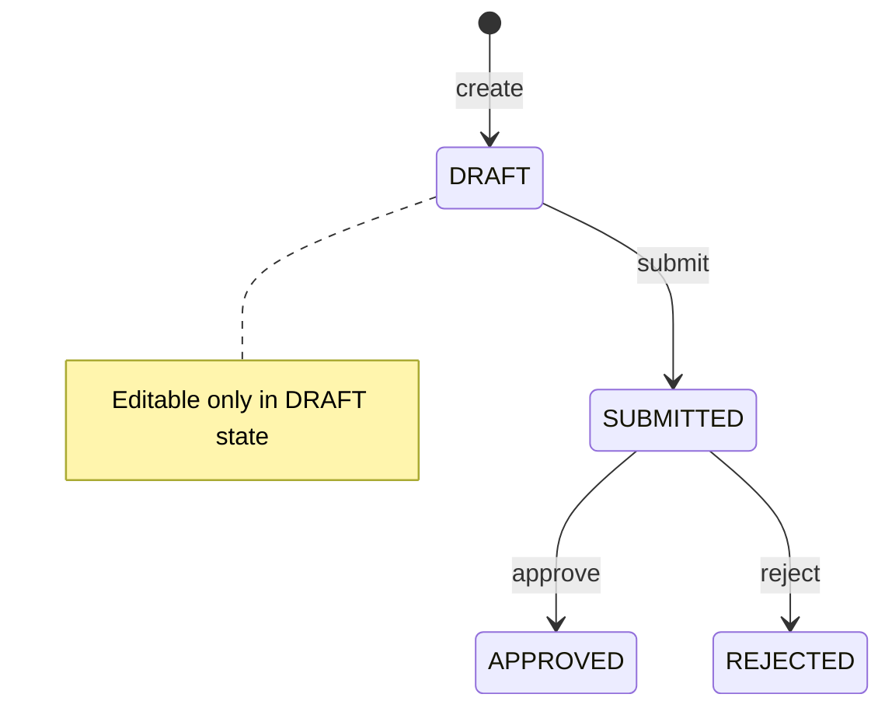

# 経費申請・承認API（Expense Claim Approval API）
## 概要

本アプリケーションは、Spring Boot を用いた経費申請ワークフロー管理のためのREST APIです。

単純なデータ更新（CRUD）ではなく、業務システムにおける「状態遷移」と「ビジネスルールの一貫性」を重視した設計としています。

申請の作成・編集・申請・承認・却下といった一連のワークフローを、状態に応じた操作として明示的に表現しています。

---
## 設計方針
### 状態遷移モデルを採用した理由

本アプリケーションでは、経費申請を単なるデータ更新としてではなく、「状態に応じて許可される操作が変わるワークフロー」として捉えています。

そのため、CRUDを中心に設計するのではなく、

- submit（申請）
- approve（承認）
- reject（却下）

といった業務上の操作を明示した状態遷移モデルを採用しています。

これにより、

- APIの責務と業務操作の対応関係が明確になる
- 状態ごとの制約を一貫して扱える
- ワークフローの整合性を保ちやすくなる

という利点があります。

### 責務分担

#### 各レイヤの責務の考え方
- Controller
  - リクエスト/レスポンスの入出力を担当し、HTTPインターフェースに関する処理に限定しています。
- Service 
  - ユースケースの実行を担当し、処理の流れを制御します。 状態遷移の呼び出しや、各コンポーネントの調整を行います。 
- Status（Enum） 
  - 状態ごとに許可される操作（submit / approve / reject など）の判定を担当します。 
  - 状態遷移に関するルールはここに集約しています。
- Entity 
  - ドメインデータを表現し、整合性を守るための最低限の防御的チェックを持ちます。
- Repository 
  - 永続化処理の抽象化を担当します。 
  - Service はデータアクセスの実装詳細に依存せず、Repository を通してデータを扱います。

#### Repository設計の方針

Repositoryは、業務ロジックから見た永続化の窓口として設計しています。

Serviceは業務側のExpenseClaimRepositoryインタフェースに依存し、保存や取得の具体的な方法には依存しない構成としています。

実装としては、開発初期にはInMemory Repositoryを利用し、その後JPAを用いた実装に差し替えました。  
このときもService側のコードを大きく変更せずに移行できるよう、業務側のRepositoryインターフェースと永続化の実装を分離しています。
また、Spring Data JPAのRepositoryは業務コードから直接利用せず、JPA実装クラスの内部で利用する形としています。

このように、業務ロジックと永続化技術の依存関係を分離することで、実装の差し替えやテストをしやすい構成を意識しています。

#### 例外処理とHTTPレスポンスの責務

HTTPステータスコードの決定はService層では行わず、GlobalExceptionHandlerに集約しています。

Service層はHTTPに依存しない形で例外を投げ、HTTPレスポンスへの変換はController層（例外ハンドラ）で行う構成としています。

これにより、
- Service層をHTTPプロトコルから独立させる
- ビジネスロジックとプレゼンテーション層の関心を分離する
- 例外処理の一貫性を担保する

ことを意識しています。

### なぜPATCHを採用したか

下書き（DRAFT）状態における編集は、全項目の更新ではなく一部項目の修正が中心となるため、部分更新を表現できるPATCHを採用しています。

### 認証・認可を後回しにしている理由

本来、業務システムにおいて認証・認可は重要な要素ですが、本プロジェクトでは「ワークフロー設計」と「ビジネスルールの実装」に焦点を当てるため、優先順位を下げています。

現在はダミーユーザーを使用していますが、将来的にはSpring Security等による認証・認可の導入を想定しています。

---
## 機能一覧

- 経費申請の作成
- 経費申請一覧取得
- 経費申請詳細取得
- 下書きの編集
- 申請（submit）
- 承認（approve）
- 却下（reject）

---
## 状態遷移図

---
## ワークフロールール

- 申請はDRAFT状態で作成される
- DRAFT状態のみ編集可能
- DRAFT状態のみ申請可能
- 申請後は編集不可（ロック）
- SUBMITTED状態のみ承認・却下可能
- reviewerCommentは承認・却下時のみ扱う

---
## API一覧

| Method | Path                         | 説明    |
| ------ | ---------------------------- | ----- |
| POST   | /expense-claims              | 申請作成  |
| GET    | /expense-claims              | 一覧取得  |
| GET    | /expense-claims/{id}         | 詳細取得  |
| PATCH  | /expense-claims/{id}         | 下書き編集 |
| POST   | /expense-claims/{id}/submit  | 申請    |
| POST   | /expense-claims/{id}/approve | 承認    |
| POST   | /expense-claims/{id}/reject  | 却下    |

---
## 技術スタック
- Java
- Spring Boot
- PostgreSQL
---

## テスト

Service層に対して以下のテストを実施しています：

- 正常な状態遷移
- 不正な状態遷移
- バリデーションエラー
- Not Foundケース
- 部分更新（PATCH）の挙動

---
## 起動方法

### 前提

* Docker Desktop が起動していること
* Java 21 が利用できること

### 1. ビルド

```bash
./mvnw clean package
```

### 2. 起動

```bash
docker-compose up -d --build
```

### 3. アクセス

* Swagger UI  
  [http://localhost:8080/swagger-ui.html](http://localhost:8080/swagger-ui.html)

### 4. 停止

```bash
docker-compose down
```

データも削除する場合：

```bash
docker-compose down -v
```


---
## APIドキュメント

Swagger UI からAPIの仕様確認およびリクエスト実行が可能です。

http://localhost:8080/swagger-ui.html

---
## English Summary

This is a Spring Boot based REST API for expense claim workflow management.

The application focuses on:

- state transitions
- workflow consistency
- business rule validation

Authentication and authorization are intentionally out of scope for this version.
